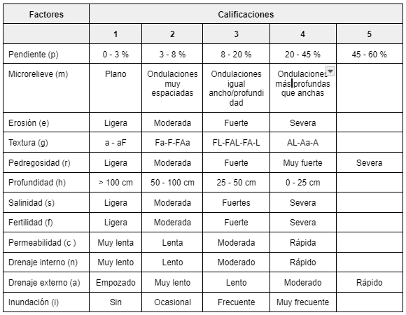

# Materiales y Metodos

## Localizacion

El área prioritaria que se estudia comprende los estados Anzoátegui, Aragua, Barinas, Carabobo, Cojedes, Portuguesa, Guárico, Monagas y Yaracuy (Ver Figura xx). Sin embargo el presente documento se concentra en los estados centrales de Aragua, Carabobo y Yaracuy, con una superficie de 18.763.58 km2 aproximadamente. (Ver Figura 1).

<center></center>
<center> **Figura 1.** Localización relativa del área de estudio. <a href="Pdfs/Region1.pdf" target="_blank" title="descarga">Enlace</a></center>


## Materiales

#### Informacion {-}

los datos empleados fueron el resultados de búsquedas exhaustiva en diferentes ambientes digitales y analogicos y de ellas destacan:

* Sistemas Ambientales Venezolanos
* Unidades Cartográficas de Suelos del Proyecto Marnot (Por publicar).
* Información de Perfiles de suelos sobre el país SISLAC-FAO.
* Información de Monolitos y perfiles de suelos de la Base de datos SIMIS (INIA).
* Información de Perfiles de suelos de PDVSA y PEQUIVEN.
* Modelos digitales de Carbono Orgánico de los suelos
* Modelos digitales de Arena, limo y arcillas de los suelos
* Modelos digitales de Conductividad eléctrica de los suelos
* Modelo digital de Ph de los suelos
* Modelo digital de elevación del terreno SRTM 90 m (NASA).
* Información de Perfiles de suelos de la Cuenca del Río Canoabo (PEQUIVEN). 
* Información de Perfiles de suelos de la Cuenca del Río Sanchón (PEQUIVEN).

#### Aplicaciones {-}

Para lograr los objetivos planteados y poder manipular información del tipo atributiva y tambien geo-espacial se emplea las herramientas de entorno informático como Excel, Arcview 32, QGIS, ArcInfo, ArcGIS, Access, DBDiagram.io y Rmarkdown. Las mencionadas aplicaciones permiten almacenar ordenadamente la información conseguida y también la posibilidad de normalizarlas a un proyección cartográfica Universal Transversal de Mercator (UTM), Huso 19 Norte, Datum SIRGAS-REGVEN. Además es indispensable para el análisis espacial y la aplicación de códigos  para la automatización de procesos.

## Métodos

El esquema metodológico empleado para desarrollar cada producto de los objetivos siguió las pasos  que se describen a continuación: 

1. Para el desarrollo de la **Base de Datos (BD)** de fuentes de información disponibles, se procederá siguiendo los siguientes pasos:

* Búsqueda de información sobre suelos y variables auxiliares relacionadas con los mismos, de las entidades priorizadas.
* Análisis y consideración de los posibles tipos de información edáfica encontrada (digital, analógica, temática, atributiva, geo espacial, mapas de clases de suelos (poligonales), mapas de cheques de suelos (puntos), entre otras para lograr una estructuración uniforme y manejable.
* Diseño del diagrama Entidad-Relación de la base de datos, describiendo sus posibles tablas, campos, tipo de los campos y cardinalidad de la relación entre tablas. Para lo que se emplea la herramienta DBDiagram.io, la cual es una aplicación WEB en línea que permite la creación de prototipos de entidades – relaciones.
* Creación de tablas en la aplicación excel, incorporación y normalización de su información para su posterior exportación a la aplicación de gestión de bases de datos access.
* Exportación a la aplicación access, creación del modelo relacional para la administración de la base de datos y la formulación de consultas tipo.

2. **Unidades Cartográficas de suelos categorizadas** según su aptitud para el cultivo de cereales y leguminosas en las entidades priorizadas.

#### Consideraciones generales {-}

El nivel de estudio de suelos para esta actividad es categorizado como de “Gran Visión” debido a la gran extensión de su superficie y a la generalidad de cultivos que se desea estudiar (Cereales que requieren suelos bien drenados y leguminosas). Por ende el uso de información geo-espacial sobre variables físico naturales a escalas 1:250.000 se considera adecuado, además a la consideración de que en Venezuela la superficie estudiada sobre suelos con el detalle idóneo es menos del 3%. 

Por otro parte la metodología empleada para establecer una categorización de posibles tierras aptas para este cultivo fue la del Sistema de Clasificación por su Capacidad de Uso Agropecuario (Klingebiel y Montgomery, 1961) modificada y adaptadas a nuestras condiciones por Comerma y Arias (1971). Cuyo propósito y basamento fundamental es el de interpretar el medio físico natural, para agrupar porciones de terreno en base a su capacidad para producir plantas cultivadas (cultivos, pastos y bosques comunes), sin deterioro del suelo por largos periodos de tiempo. Así al mismo tiempo que trata de lograr una adecuada utilización del recurso tierra, enfatiza el punto de vista conservacionistas de dicho recurso. Finalmente se consideró el empleo de este sistema ya que sus resultados son de fácil entendimiento para los diferentes tipos de usuarios (Investigadores, productores, docentes, estudiantes entre otros), además que su uso y trayectoria en el país está ampliamente comprobada. 

La aplicación del Sistema de Capacidad de uso agropecuario se realizará de manera simplificada solo con el fin de estratificar el área de estudio según sus grandes limitaciones y alto potencial, y así por un lado descartar las tierras con limitaciones difíciles de saldar y por el otro establecer las áreas de mayor potencial para el cultivo de Cereales y Leguminosas. Que resultan en posibles ventanas para futuras investigaciones a escalas más detalladas, y en las cuales se podrían aplicarse las Directivas de FAO para la evaluación de la aptitud de las tierras en agricultura de secano (FAO, 1985).

Debido a lo expuesto este sistema no establece una diferencia entre cultivos de Cereales y leguminosas para otorgar su categorización pero sí establece claramente la  posibilidades de adaptación y sostenibilidad de ambos en las tierras, lo que se considera un buen adelanto preliminar para estratificar las tierras del área de estudio en zonas potenciales y áreas con grandes limitaciones no aptas. Estas tierras potencialmente aptas podrían considerarse ventanas de estudios a mayor detalle donde aplicar directivas de evaluación de tierras más específicas y obtener con precisión la aptitud individual para cultivos como: Cereales que requieren buen drenaje (maíz, sorgo, etc), Cereales adaptados a condiciones de mal de drenaje de los suelos (arroz) y Leguminosas (Caraota, Frijol, Quinchoncho, etc), con niveles de manejos más específicos,

Las clases de capacidad agrupan suelos con similares grados y números de limitaciones para su su uso, en total se consideran 8 clases, las 4 primeras, pueden producir cultivos comunes adaptables, pastos y árboles, incrementando de la Clases I a la IV las limitaciones en amplitud de su uso y en riesgos o daños al suelo. Es en estas clases donde se considera posible el cultivo de cereales que requieren suelos de buen drenaje y leguminosas.

Las clases V, VI, y VII son en general adecuadas para el uso de plantas nativas, principalmente pastos y árboles. Sin embargo, algunos suelos de la clase V y VI pueden producir cultivos especiales, como frutales, ornamentales, ciertas hortalizas, etc, pero bajo prácticas especiales de manejo.

La Clase VIII se destina a las áreas con el mayor grado de limitaciones y riesgos. Se considera que no paga los gastos de manejo para cultivos, pastos o bosques, sin prácticas mayores de recuperación. Por ello se destina a fines de conservación y recreación. Para este trabajo las clases V, VI, VII y VIII no se consideran aptas para el cultivo de cereales que requieren suelos de buen drenaje y leguminosas.

Para establecer la capacidad de uso agropecuario de las tierras, en este estudio se  estableció un nivel de manejo tecnológico usual (frecuente) del cultivo de Cereales y leguminosas, el cual corresponde a una agricultura donde no se incluyen obras de riego y/o drenaje, pero que puede incluir una amplia gama de condiciones acerca de aplicación o no de fertilizantes, pesticidas, practicas de conservacion, maquinaria, etc. Por lo tanto en este nivel se contempla desde la agricultura de conuco hasta una muy tecnificada pero siempre con exclusión de obras de riego y/o drenaje. (Comerma y Arias, 1971).

Para establecer los niveles de aptitud de las tierras para el cultivo de Cereales y leguminosas, se relaciona cada uno de estos niveles con las primeras cuatro clases de capacidad de uso, debido a como se mencionó anteriormente que las clases I, II, III y IV poseen menores limitaciones y riesgos por ende tienen a tener mayor aptitud y probabilidad de éxitos en su cosecha y rendimientos. Por eso la Clase I se establece como “Apta”, las Clase II y III son “Moderadamente aptas”, la Clase IV es “Marginalmente apta” y las clases V, VI, VII y VIII son “No aptas”. 

#### Adecuación de Unidades Cartográficas {-}

La base que conforman las Unidades cartográficas de suelos para este estudio son las delineaciones de los Proyecto “Manejo de Recursos Naturales y Ordenamiento de Tierras” (MARNOT, 2008) y el Proyectos de los “Sistemas Ambientales Venezolanos” (MARNR-COPLANARH, 1983). Adicionalmente para completar, actualizar e incrementar detalles de alguna información específica especialmente en las áreas montañosas se emplearon los modelos digitales de terrenos recientemente generados en el país mediante Cartografía Digital por investigadores nacionales con el apoyo de FAO, en donde destacan el mapa de propiedades de los suelos como Carbono Orgánico, Arena, limo y arcilla de los suelos superficiales (Sevilla et al, 2013), Mapa de Stock de Carbono orgánico de los suelos FAO 2019 y Mapa de Salinidad de los suelos (Sevilla et al no publicado). También se empleó el modelo digital de elevación SRTM de 90 m NASA (NASA, 2000) y la Base de datos mundial armonizada de suelos de FAO (FAO/IIASA/ISRIC/ISSCAS/JRC, 2012). 

Además se consideró el empleo de otra información disponibles en la red sobre diferentes variables ambientales como: Imágenes de sensores remotos a bordo de satélites como Landsat (NASA/USGS, 1999), MODIS (NASA MODIS, 1999) y Sentinel de la Agencia Aeroespacial Europea (ESA, 1975), WorldClim (2020), Soilgrids (ISRIC, 2020), SISLAC (FAO, 2012).

Con todo se logró obtener  las características o variables del medio físico natural útiles para calificar los doce factores específicos del Sistema de clasificación por capacidad de uso.

#### Calificación de Factores específicos de capacidad de uso {-}

En este paso se toman las características o variables del medio para interpretar y calificar los doces (12) factores específicos considerados en el Sistema de clasificación de Capacidad de uso agropecuario como: Pendiente (p), Microrelieve (m), Erosión (e), Texturas (g), Pedregosidad (p), Profundidad (h), Salinidad (s), Fertilidad (f), Permeabilidad ©, Drenaje interno (n), Drenaje externo (a) e Inundación (i).  

Para lograr esta interpretación y calificación se emplearon las reglas mostradas en el Cuadro 1.

<center></center>


## Chapters and sub-chapters

There are two steps to cross-reference any heading:

1. Label the heading: `# Hello world {#nice-label}`. 
    - Leave the label off if you like the automated heading generated based on your heading title: for example, `# Hello world` = `# Hello world {#hello-world}`.
    - To label an un-numbered heading, use: `# Hello world {-#nice-label}` or `{# Hello world .unnumbered}`.

1. Next, reference the labeled heading anywhere in the text using `\@ref(nice-label)`; for example, please see Chapter \@ref(cross). 
    - If you prefer text as the link instead of a numbered reference use: [any text you want can go here](#cross).

## Captioned figures and tables

Figures and tables *with captions* can also be cross-referenced from elsewhere in your book using `\@ref(fig:chunk-label)` and `\@ref(tab:chunk-label)`, respectively.

See Figure \@ref(fig:nice-fig).

```{r nice-fig, fig.cap='Here is a nice figure!', out.width='80%', fig.asp=.75, fig.align='center', fig.alt='Plot with connected points showing that vapor pressure of mercury increases exponentially as temperature increases.'}
par(mar = c(4, 4, .1, .1))
plot(pressure, type = 'b', pch = 19)
```

Don't miss Table \@ref(tab:nice-tab).

```{r nice-tab, tidy=FALSE}
knitr::kable(
  head(pressure, 10), caption = 'Here is a nice table!',
  booktabs = TRUE
)
```
