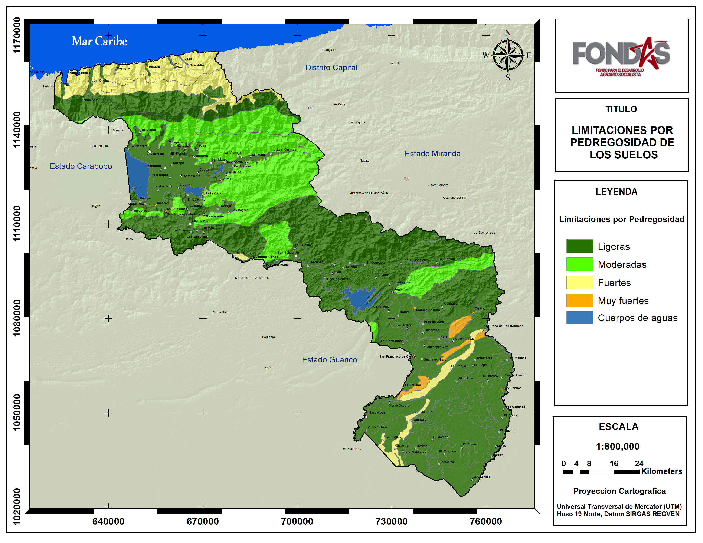
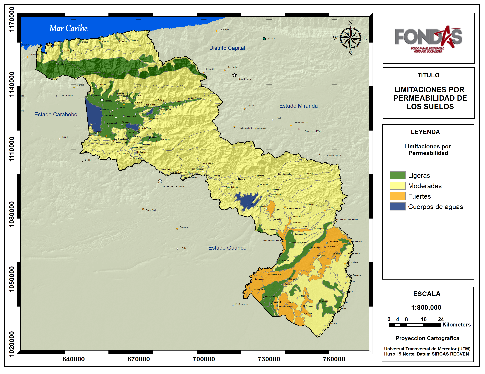
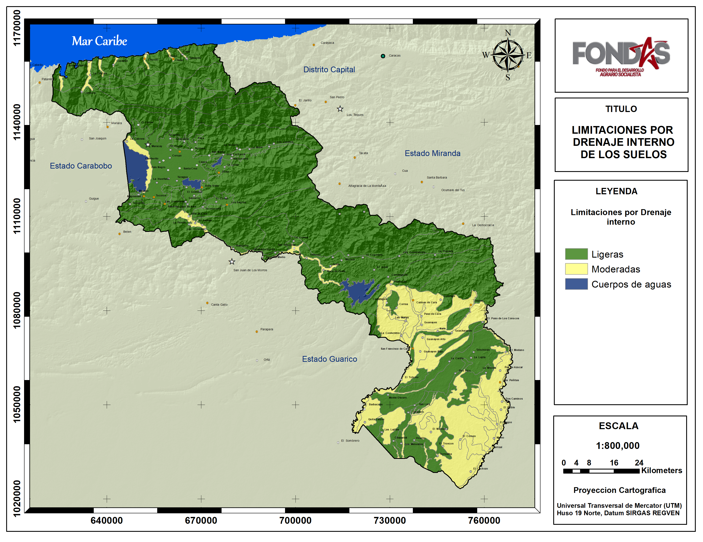

# Resultados

Los resultados obtenidos en este trabajo se describen a continuación abarcando tres grandes aspectos: la clasificación por factores específicos del sistema de Clasificación por capacidad de uso agropecuario, mostrando las principales limitaciones físico natural de las tierras por cada estado; La clasificación por capacidad de usos (clases) de las tierras de cada estado superficies y proporción y finalmente la aptitud físico natural para el cultivo de cereales que requieren suelos bien drenados y leguminosas .

## Factores específicos

#### Estado Aragua {-}

De la calificación de cada uno de los factores específicos del Sistema de Clasificación por Capacidad de Uso agropecuario aplicado al estado Aragua (Figuras 2 a 13), se desprende que las mayores limitaciones del medio físico natural encontradas en el estado para el cultivo de Cereales y leguminosas, son las altas pendientes y el microrelieve del terreno especialmente en la Cordillera de la Costa y la Serranía del interior, las cuales en algunos casos pueden presentar también limitaciones por profundidad de los suelos y erosión actual. Otra limitación encontrada también en las zonas montañosas son la poca fertilidad natural de sus suelos, con pH ácidos y baja saturación de bases en superficies. Finalmente las limitaciones relacionadas con el drenaje son más frecuentes en la parte Sur del estado en el Municipio Urdaneta, donde se presentan suelos más arcillosos comprometidos en cuanto a su permeabilidad y con drenajes externos lentos, además de las tierras en el borde del lago de Valencia. En estas últimas zonas también se pueden presentar inundaciones ocasionales relacionadas con cursos de ríos y lagos.

---

**Figura 2.** Calificación de las limitaciones por Pendientes del terreno en el estado Aragua.

 
<!-- <a href="Pdfs/Region1.pdf" target="_blank" title="descarga">Enlace</a>
 -->

**Figura 3.** Calificación de las limitaciones por Microrelieve del terreno en el estado Aragua.

 
<!-- <a href="Pdfs/Region1.pdf" target="_blank" title="descarga">Enlace</a>
 -->

 **Figura 2.** Calificación de las limitaciones por Pendientes del terreno en el estado Aragua.

<!-- <a href="Pdfs/Region1.pdf" target="_blank" title="descarga">Enlace</a>
 -->

 **Figura 2.** Calificación de las limitaciones por Pendientes del terreno en el estado Aragua.

<!-- <a href="Pdfs/Region1.pdf" target="_blank" title="descarga">Enlace</a>
 -->

 **Figura 2.** Calificación de las limitaciones por Pendientes del terreno en el estado Aragua.

<!-- <a href="Pdfs/Region1.pdf" target="_blank" title="descarga">Enlace</a>
 -->

 **Figura 2.** Calificación de las limitaciones por Pendientes del terreno en el estado Aragua.

<!-- <a href="Pdfs/Region1.pdf" target="_blank" title="descarga">Enlace</a>
 -->

 **Figura 2.** Calificación de las limitaciones por Pendientes del terreno en el estado Aragua.

<!-- <a href="Pdfs/Region1.pdf" target="_blank" title="descarga">Enlace</a>
 -->

 **Figura 2.** Calificación de las limitaciones por Pendientes del terreno en el estado Aragua.

<!-- <a href="Pdfs/Region1.pdf" target="_blank" title="descarga">Enlace</a>
 -->

 **Figura 2.** Calificación de las limitaciones por Pendientes del terreno en el estado Aragua.

<!-- <a href="Pdfs/Region1.pdf" target="_blank" title="descarga">Enlace</a>
 -->

 **Figura 2.** Calificación de las limitaciones por Pendientes del terreno en el estado Aragua.

<!-- <a href="Pdfs/Region1.pdf" target="_blank" title="descarga">Enlace</a>
 -->

 **Figura 2.** Calificación de las limitaciones por Pendientes del terreno en el estado Aragua.

<!-- <a href="Pdfs/Region1.pdf" target="_blank" title="descarga">Enlace</a>
 -->

 **Figura 2.** Calificación de las limitaciones por Pendientes del terreno en el estado Aragua.

<!-- <a href="Pdfs/Region1.pdf" target="_blank" title="descarga">Enlace</a>
 -->

---

#### Estado Carabobo {-}

---

#### Estado Yaracuy {-}
