# Aragua {-}

### Factores específicos {-}

De la calificación de cada uno de los factores específicos del Sistema de Clasificación por Capacidad de Uso agropecuario aplicado al estado Aragua (Figuras 2 a 13), se desprende que las mayores limitaciones del medio físico natural encontradas en el estado para el cultivo de Cereales y leguminosas, son las altas pendientes y el microrelieve del terreno especialmente en la Cordillera de la Costa y la Serranía del interior, las cuales en algunos casos pueden presentar también limitaciones por profundidad de los suelos y erosión actual. Otra limitación encontrada también en las zonas montañosas son la poca fertilidad natural de sus suelos, con pH ácidos y baja saturación de bases en superficies. Finalmente las limitaciones relacionadas con el drenaje son más frecuentes en la parte Sur del estado en el Municipio Urdaneta, donde se presentan suelos más arcillosos comprometidos en cuanto a su permeabilidad y con drenajes externos lentos, además de las tierras en el borde del lago de Valencia. En estas últimas zonas también se pueden presentar inundaciones ocasionales relacionadas con cursos de ríos y lagos.

---

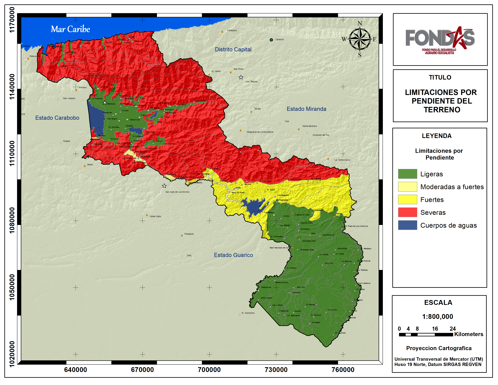**Figura 2.** Calificación de las limitaciones por pendientes del terreno en el estado Aragua.  <a href="Pdfs/Aragua_Pendiente.pdf" target="_blank" title="descargar">*Descargar*</a>

 

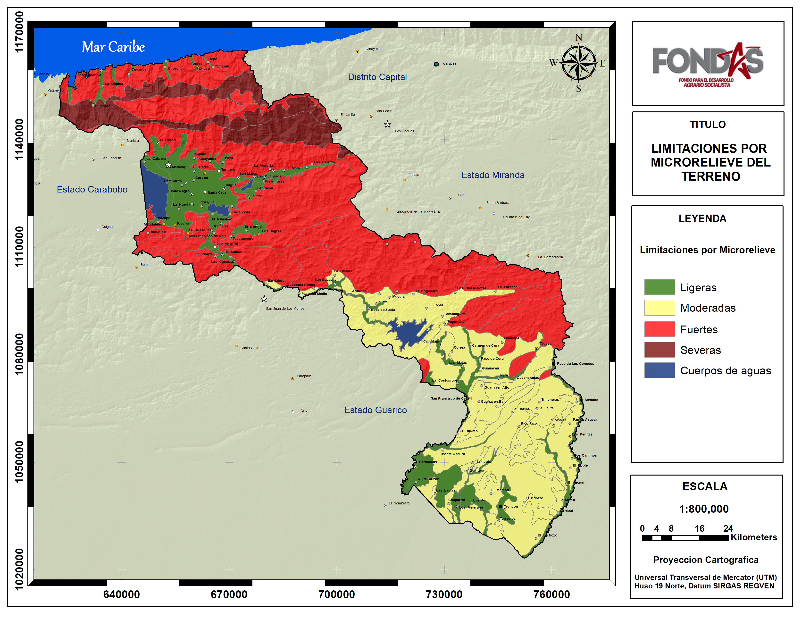
**Figura 3.** Calificación de las limitaciones por microrelieve del terreno en el estado Aragua.

 
<!-- <a href="Pdfs/Region1.pdf" target="_blank" title="descarga">Enlace</a>
 -->

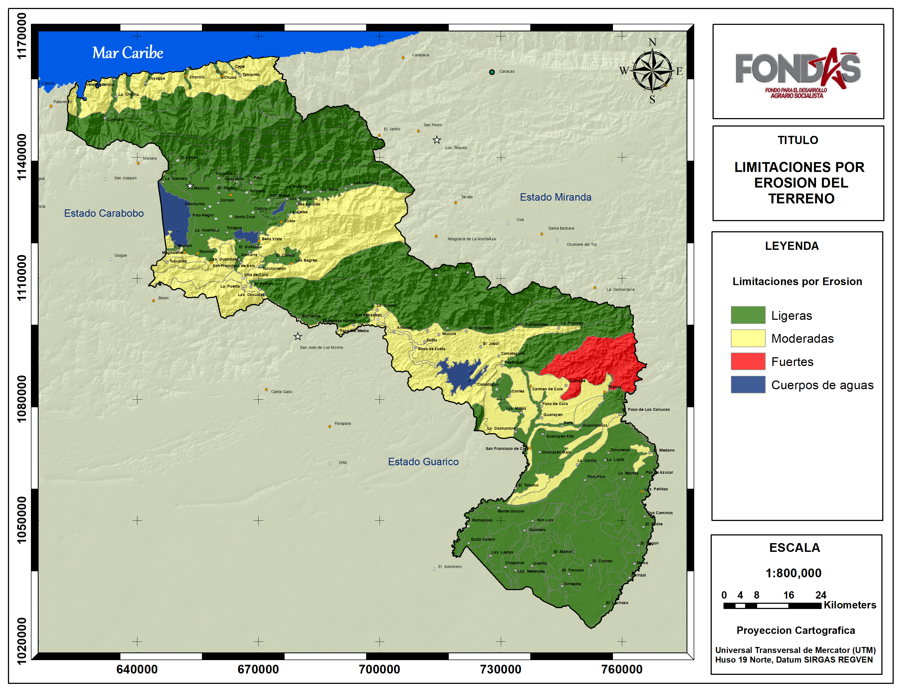
**Figura 4.** Calificación de las limitaciones por erosion del terreno en el estado Aragua.

 

<!-- <a href="Pdfs/Region1.pdf" target="_blank" title="descarga">Enlace</a>
 -->

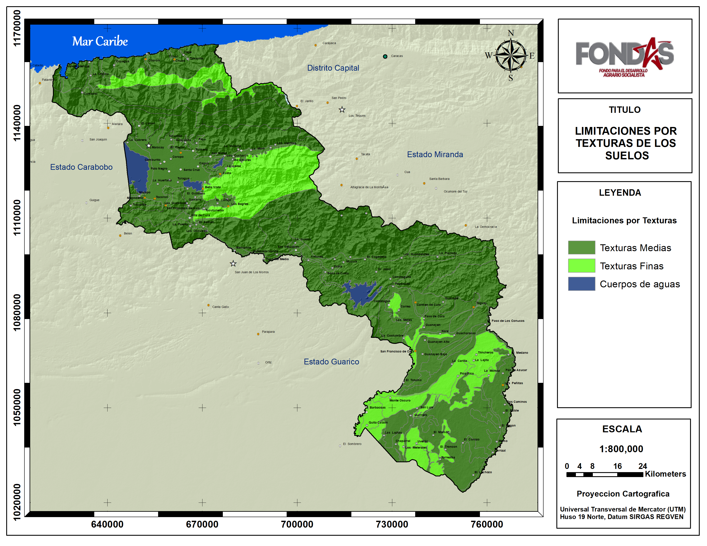
**Figura 5.** Calificación de las limitaciones por texturas de los suelos en el estado Aragua.

 

<!-- <a href="Pdfs/Region1.pdf" target="_blank" title="descarga">Enlace</a>
 -->

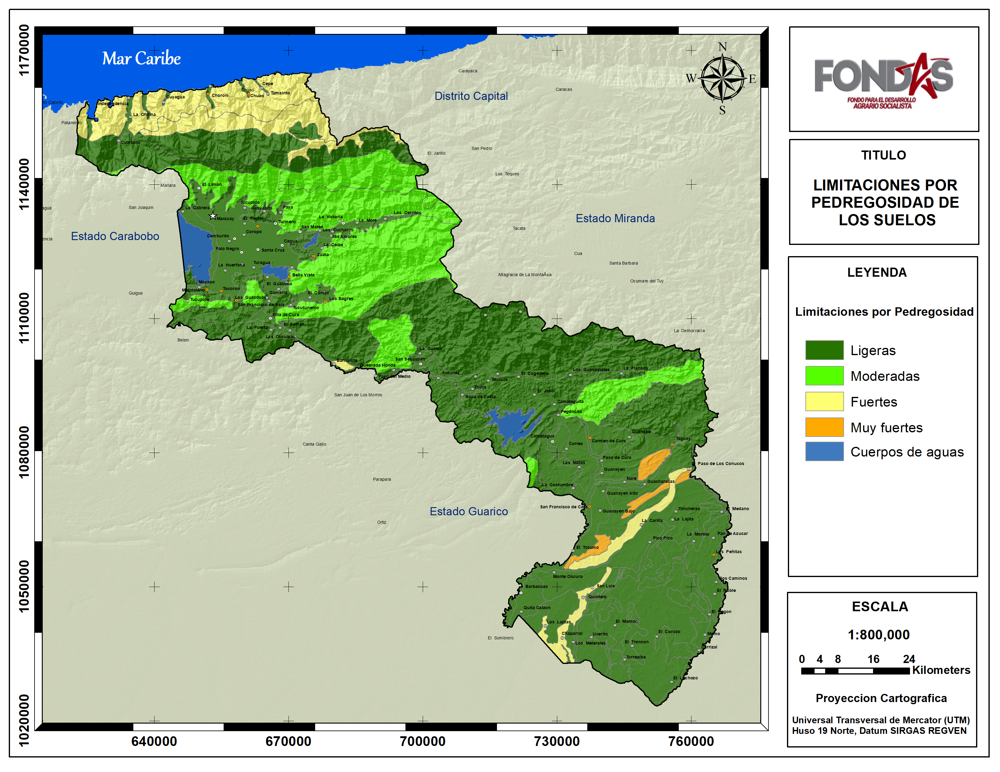
**Figura 6.** Calificación de las limitaciones por pedregosidad de los suelos en el estado Aragua.

 

<!-- <a href="Pdfs/Region1.pdf" target="_blank" title="descarga">Enlace</a>
 -->

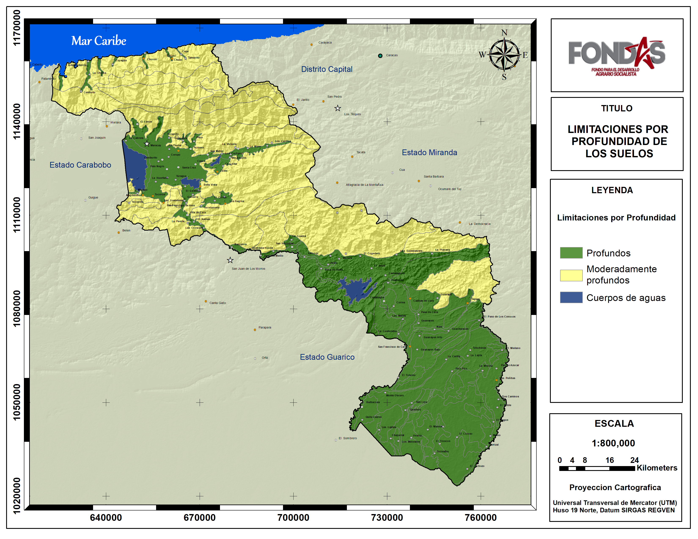
**Figura 7.** Calificación de las limitaciones por profundidad de los suelos en el estado Aragua.

 

<!-- <a href="Pdfs/Region1.pdf" target="_blank" title="descarga">Enlace</a>
 -->

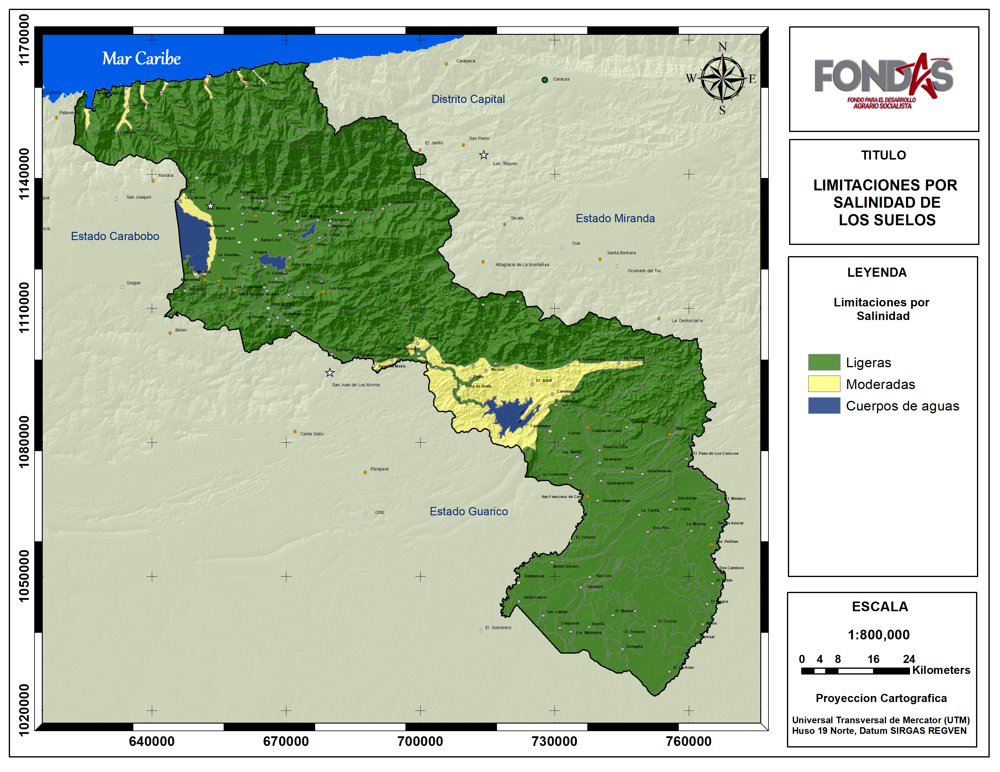
**Figura 8.** Calificación de las limitaciones por salinidad de los suelos en el estado Aragua.

 

<!-- <a href="Pdfs/Region1.pdf" target="_blank" title="descarga">Enlace</a>
 -->

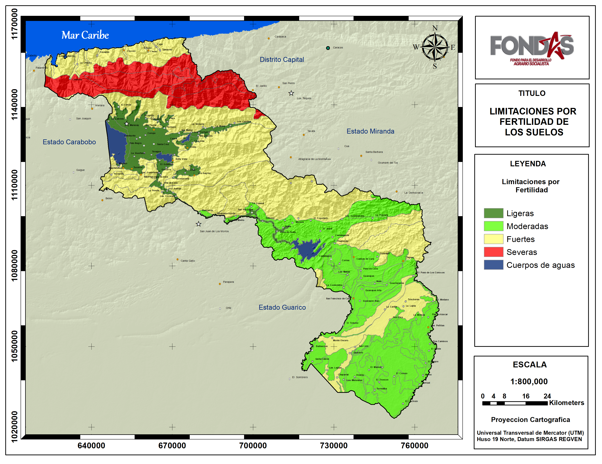
**Figura 9.** Calificación de las limitaciones por fertilidad de los suelos en el estado Aragua.

 
<!-- <a href="Pdfs/Region1.pdf" target="_blank" title="descarga">Enlace</a>
 -->

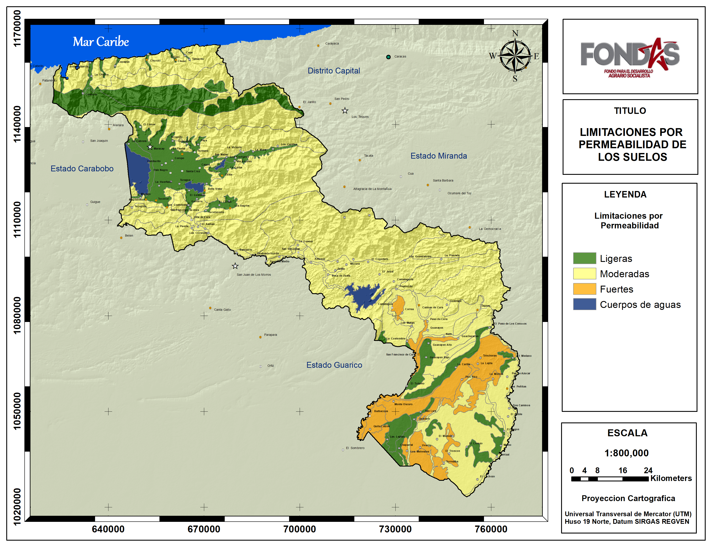
**Figura 10.** Calificación de las limitaciones por permeabilidad de los suelos en el estado Aragua.

 

<!-- <a href="Pdfs/Region1.pdf" target="_blank" title="descarga">Enlace</a>
 -->

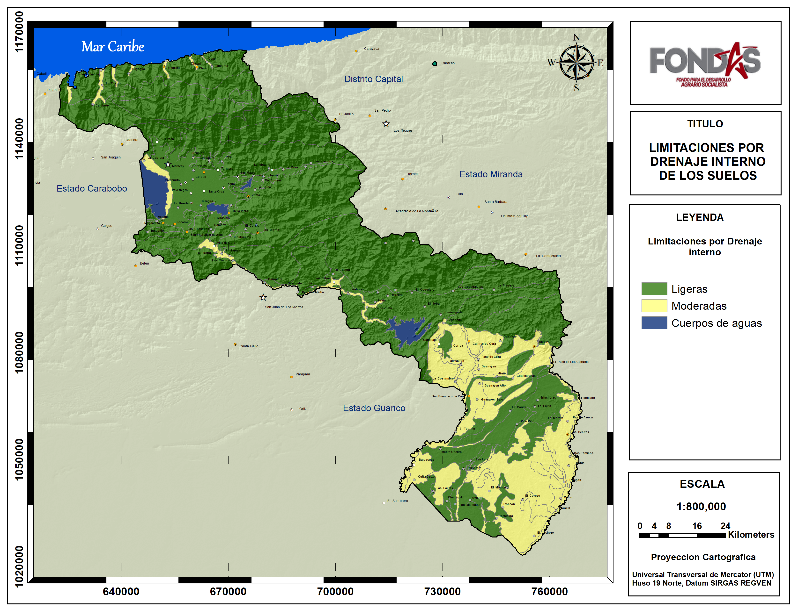
**Figura 11.** Calificación de las limitaciones por drenaje interno de los suelos en el estado Aragua.

 

<!-- <a href="Pdfs/Region1.pdf" target="_blank" title="descarga">Enlace</a>
 -->

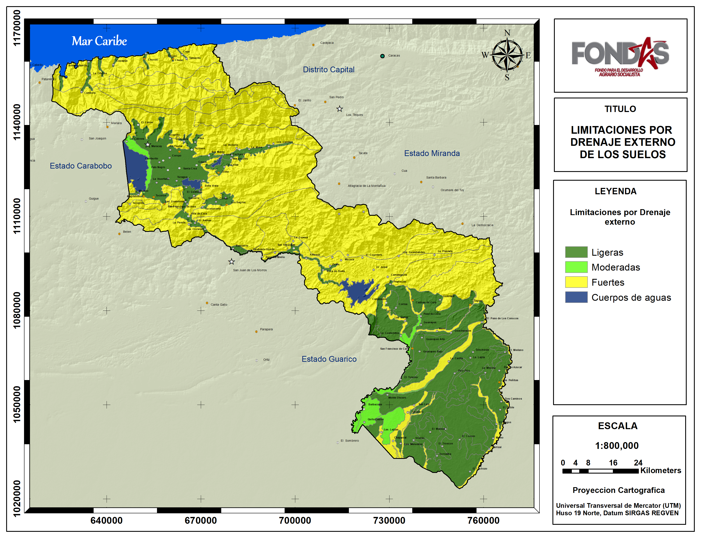
**Figura 12.** Calificación de las limitaciones por drenaje externo de los suelos en el estado Aragua.

 

<!-- <a href="Pdfs/Region1.pdf" target="_blank" title="descarga">Enlace</a>
 -->

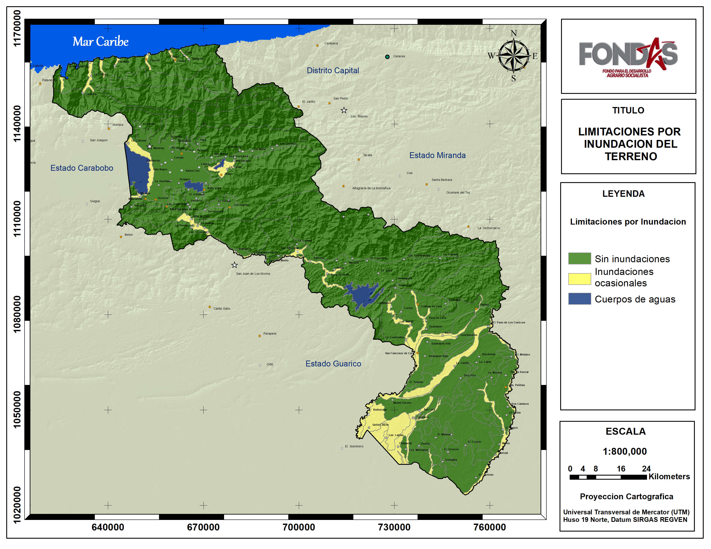
**Figura 13.** Calificación de las limitaciones por inundacion del terreno en el estado Aragua.

 

<!-- <a href="Pdfs/Region1.pdf" target="_blank" title="descarga">Enlace</a>
 -->

### Clase de Capacidad de Uso Agropecuario {-}

El estado Aragua posee una superficie de 719.133 ha (7191 km^2^) aproximadamente y de ellas 5.5 % resultaron categorizadas por su capacidad de uso agropecuario como clase I, localizadas en la cuenca plana del lago de Valencia, valles del río Tucutunemo del municipio Zamora y en el eje que transcurren desde las poblaciones Cagua, San Mateo hasta La victoria. Por otra parte 17.5 % se categorizó como clase III, ubicadas en los bordes del Lago de Valencia, y el embalse de Zuata, tierras de Tucutunemo, el Cortijo y los Bagres cercanas a Villa de Cura y también planicies aluviales entre los límites de los municipios Camatagua y Urdaneta. Otro 18.4 % resultó clase IV y se localizan en las inmediaciones del embalse de Camatagua y planicies aluviales del municipio Urdaneta. El resto de la superficie del estado (56.6%) resultaron de clases iguales o mayores a la clase V con poco potencial para el cultivo de cereales y leguminosas debido a limitaciones moderadas a fuertes principalmente relacionadas a la pendiente, profundidad, fertilidad y drenaje. (Ver Cuadro 3 y Figura 14).

**Cuadro 3.** Superficies y porcentajes por clases de aptitud para cultivar cereales y leguminosas en el Estado Aragua.

 

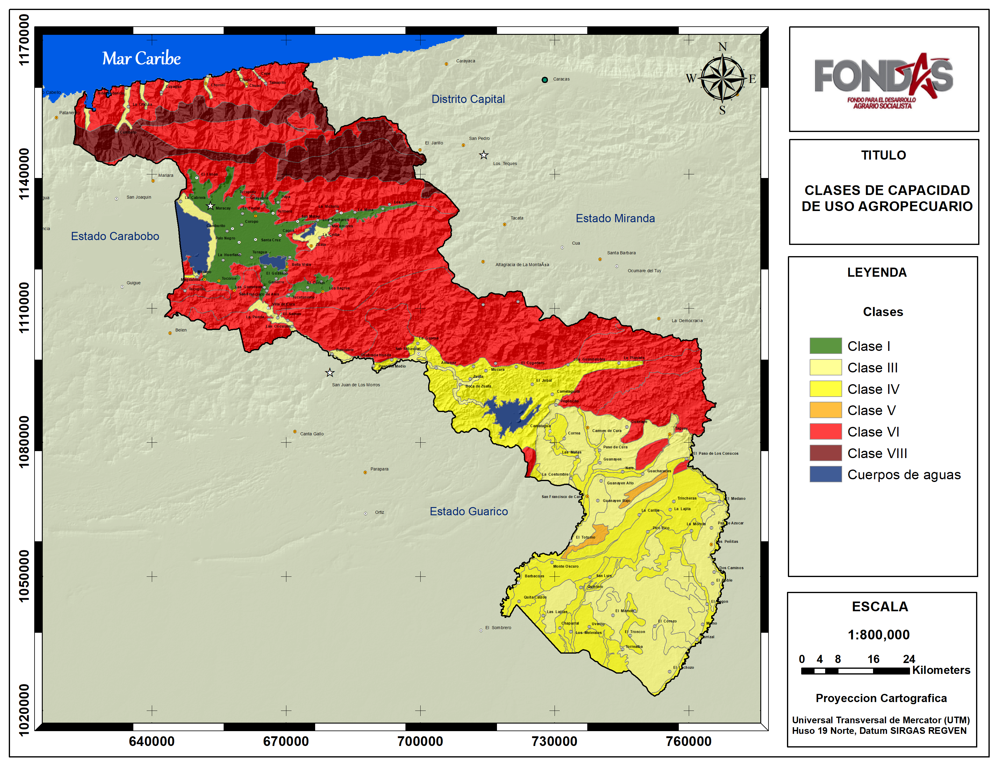
**Figura 14.** Mapa de Clases de Capacidad de Uso Agropecuario de las tierras en el estado Aragua.

 

### Clase de Aptitud para Cereales y Leguminosas {-}

En el estado Aragua 5.5 % de sus tierras se consideran aptas para el cultivos de cereales y leguminosas debido a su mayor potencial y pocas limitaciones físico naturales para el desarrollo de estos rubros. Principalmente se ubican en la cuenca plana del lago de Valencia donde destacan áreas no urbanizadas próximas al lago de Valencia y las poblaciones de Tocorón, Magdaleno, Arenales, Turagua, Santa Cruz, Guayabita, Paya y zonas aledañas al embalse de Taguayguay; por otro lado tenemos el valle del río Tucutunemo y poblaciones de los Cortijos, Las majadas, El Espinal y Los Bagres; además del eje que transcurre desde Cagua pasando por San Mateo, La Mora hasta áreas cercanas a la Victoria.

Las tierras con una actitud moderadamente representan unos 17.5%, localizadas en las márgenes del lago de Valencia no inundadas, ni pobladas, márgenes del embalse de Zuata, como el parcelamiento el Rodeo, áreas del valle del río Largo y quebrada Mujica cercanas a la Villa de Cura; planicies del río Guárico y Tinapuey zonas en el municipio Camatagua cómo Guanayen, Carmen de Cura, Taguay y el Totumo. También el sur del estado en el municipio Urdaneta, tierras cercanas a las poblaciones de Las Peñitas, La Esperanza, El Corozo, y el Lechozo.

Áreas marginalmente aptas, es decir potencialmente útiles pero con fuertes limitaciones se encontraron 18.4% del estado, ubicadas en al sur de San Sebastián, rodeando al embalse de Camatagua en los estrechos valles de las quebradas Los Marines y Camataguita y poblaciones como El jobal, Camataguita y Mucura; como también en las tierras aluviales del municipio Urdaneta cercanas a las poblaciones de Barbacoas, Monte Oscuro, Uveritos entre otros.

Las zonas no aptas alcanzan el 56.6% del estado y son áreas de montañas con altas pendientes, micro relieve irregular, drenaje externos muy rápidos, suelos poco profundos y de baja fertilidad; como suelos mal drenados muy arcillosos y con ocasionales inundaciones del sur del estado.

Las figuras 41, 42 y el Cuadro 6 muestran gráficamente la proporcionalidad de las clases y  las localidades con su categorización de aptitud para el cultivo de cereales y leguminosas.

