# Carabobo {-}

### Factores específicos {-}

De la calificación de cada uno de los factores específicos del Sistema de Clasificación por Capacidad de Uso agropecuario aplicado al estado Carabobo (Figuras 17 a 28), se desprende que las mayores limitaciones del medio físico natural encontradas en el estado para el cultivo de cereales y leguminosas, son las altas pendientes y el microrelieve del terreno especialmente en la Cordillera de la Costa y la Serranía del interior, las cuales en algunos casos pueden presentar también limitaciones por profundidad de los suelos específicamente en los piedemontes y estribaciones de la Cordillera y erosión actual en la Serranía. Otra limitación encontrada también en las zonas montañosas son la poca fertilidad natural de sus suelos, con pH ácidos y baja saturación de bases en superficies. Finalmente las limitaciones relacionadas con el drenaje interno se presentan en algunos lugares del Norte en la planicie costera donde los niveles freáticos son altos y los suelos arenosos son frecuentes, y en las zonas aledañas al lago de Valencia. Por su parte el drenaje externo en su mayoría es rápido por las grandes pendientes de la zona montañosa, sin embargo se consiguen drenajes lentos en áreas depresionales cerca del lago de Valencia. Finalmente las limitaciones por inundación son ocasionales en la planicie costera occidental en la frontera con el estado Yaracuy y en áreas del lago.

---

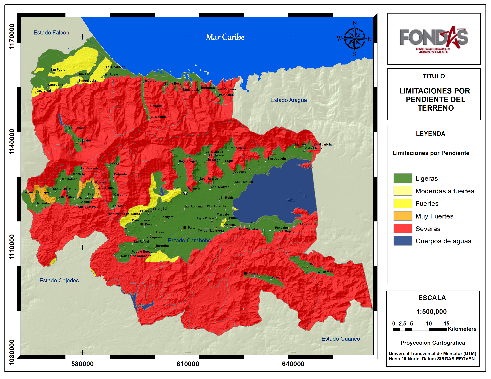**Figura 17.** Calificación de las limitaciones por pendientes del terreno en el estado Carbobo.  <a href="Pdfs/Carabobo_Pendiente.pdf" target="_blank" title="descargar">*Descargar*</a>

 

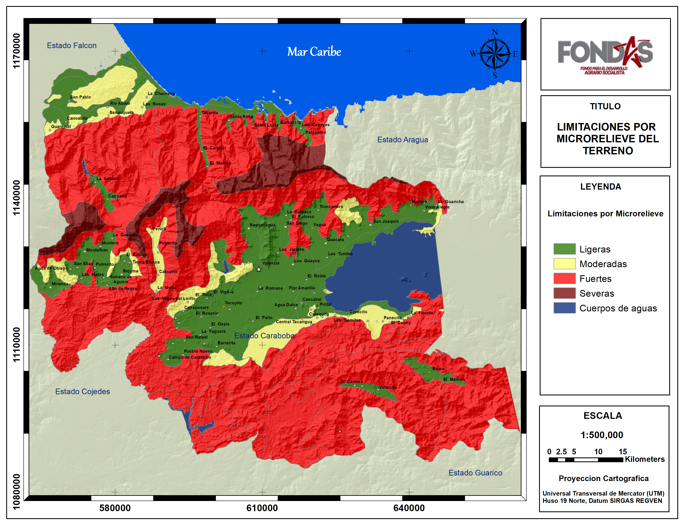
**Figura 18.** Calificación de las limitaciones por microrelieve del terreno en el estado Carabobo. <a href="Pdfs/Carabobo_Microrelieve1.pdf" target="_blank" title="descargar">*Descargar*</a>

 

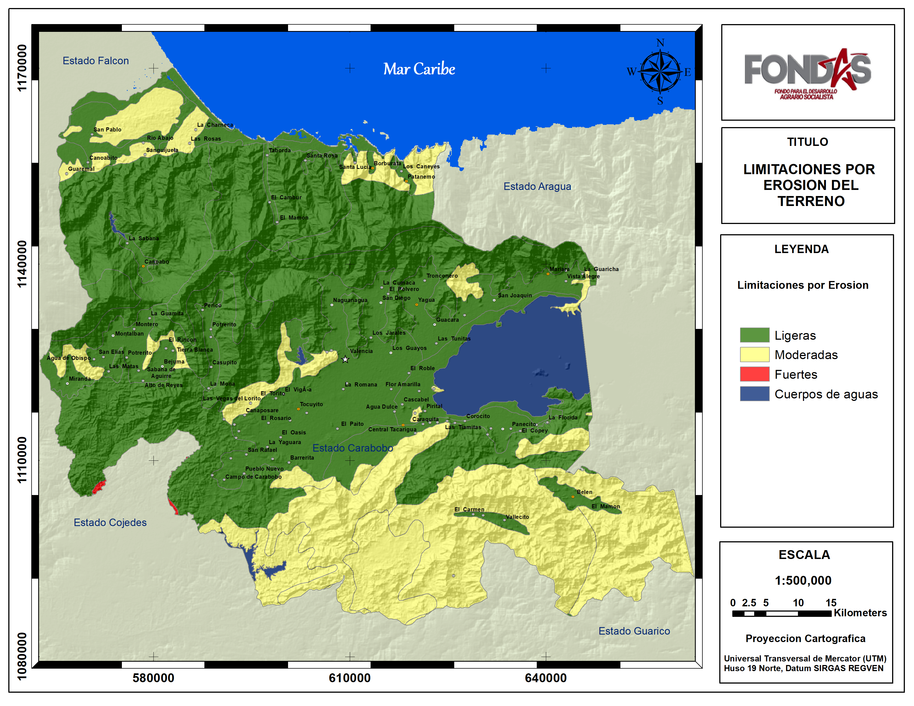
**Figura 19.** Calificación de las limitaciones por erosion del terreno en el estado Carabobo. <a href="Pdfs/Carabobo_Erosion1.pdf" target="_blank" title="descargar">*Descargar*</a>

 

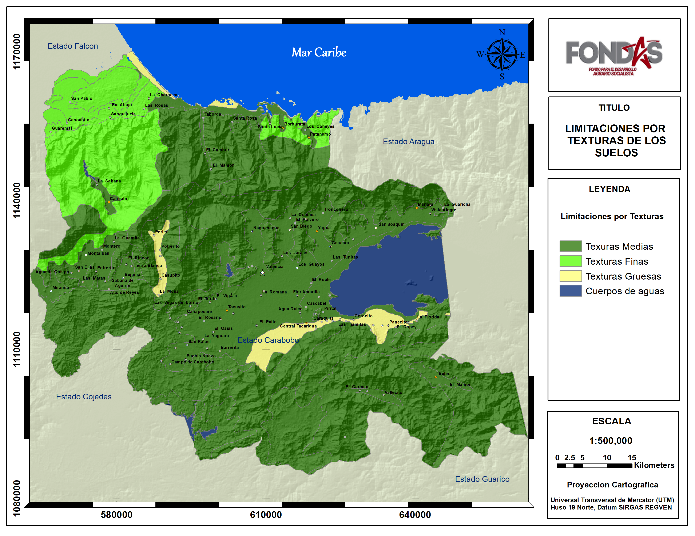
**Figura 20.** Calificación de las limitaciones por texturas de los suelos en el estado Carabobo. <a href="Pdfs/Aragua_Texturas.pdf" target="_blank" title="descargas">*Descargar*</a>

 

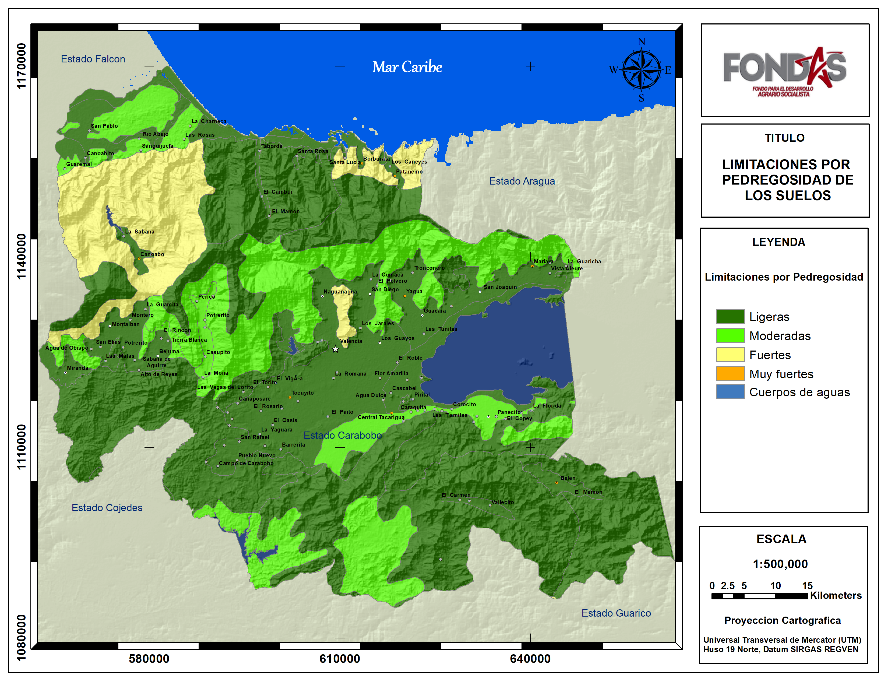
**Figura 21.** Calificación de las limitaciones por pedregosidad de los suelos en el estado Carabobo. <a href="Pdfs/Aragua_Pedregosidad.pdf" target="_blank" title="descargas">*Descargar*</a>

 

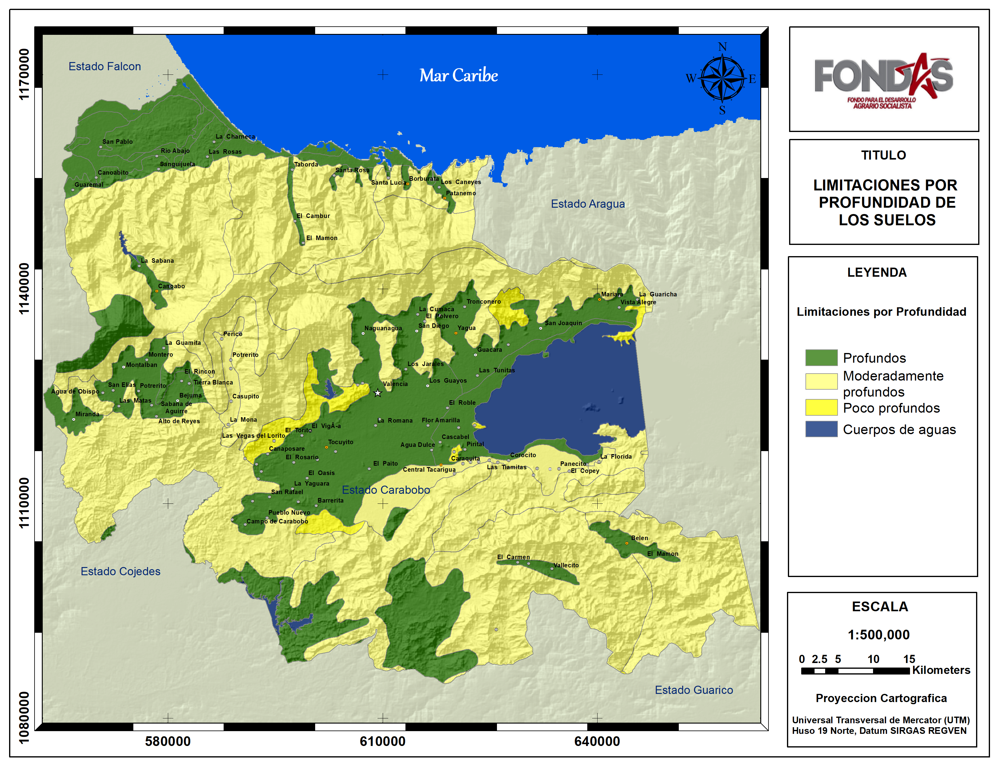
**Figura 22.** Calificación de las limitaciones por profundidad de los suelos en el estado Carabobo. <a href="Pdfs/Aragua_Profundidad1.pdf" target="_blank" title="descargas">*Descargar*</a>

 

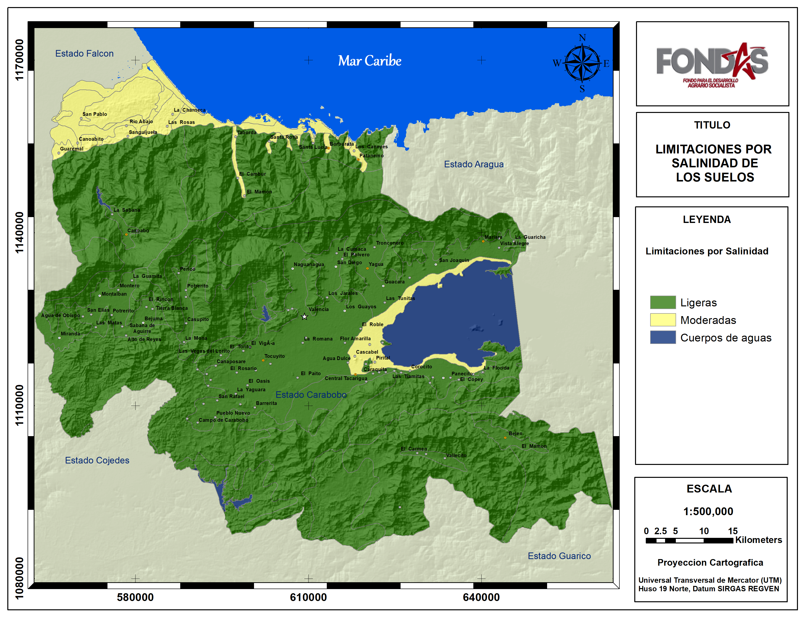
**Figura 23.** Calificación de las limitaciones por salinidad de los suelos en el estado Carabobo. <a href="Pdfs/Aragua_Salinidad1.pdf" target="_blank" title="descargas">*Descargar*</a>

 

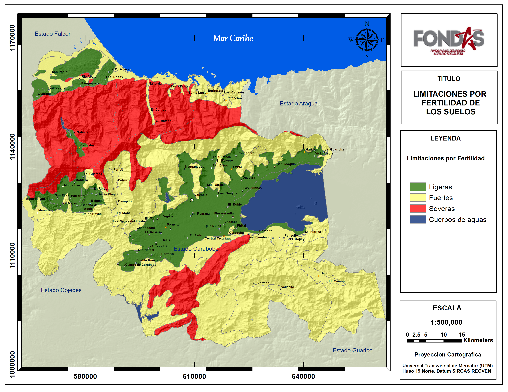
**Figura 24.** Calificación de las limitaciones por fertilidad de los suelos en el estado Carabobo. <a href="Pdfs/Aragua_Fertilidad1.pdf" target="_blank" title="descargas">*Descargar*</a>

 

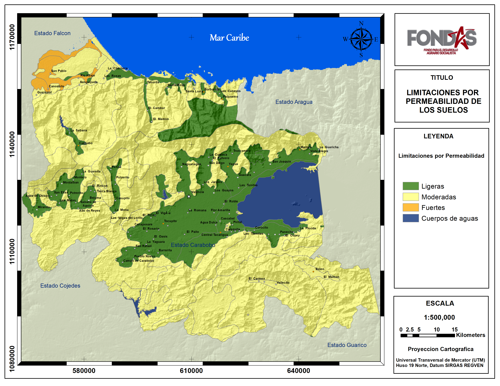
**Figura 25.** Calificación de las limitaciones por permeabilidad de los suelos en el estado Carabobo. <a href="Pdfs/Aragua_Permeabilidad1.pdf" target="_blank" title="descargas">*Descargar*</a>

 

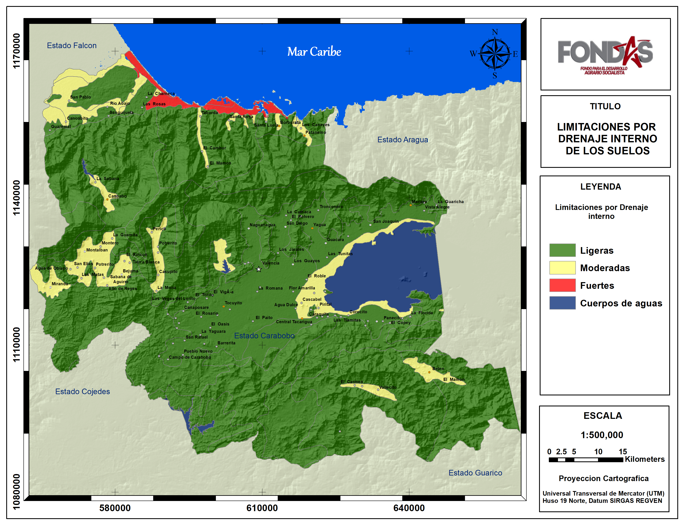
**Figura 26.** Calificación de las limitaciones por drenaje interno de los suelos en el estado Carabobo. <a href="Pdfs/Aragua_Dre_interno1.pdf" target="_blank" title="descargas">*Descargar*</a>

 

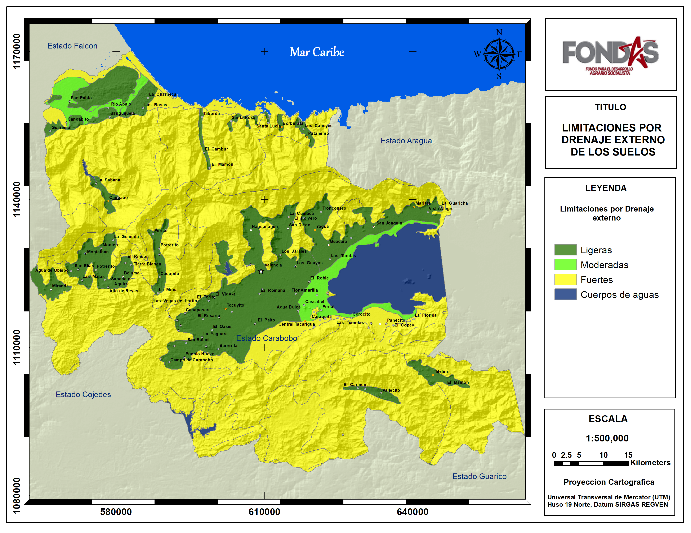
**Figura 27.** Calificación de las limitaciones por drenaje externo de los suelos en el estado Carabobo. <a href="Pdfs/Aragua_Dre_externo1.pdf" target="_blank" title="descargas">*Descargar*</a>

 

**Figura 28.** Calificación de las limitaciones por inundacion del terreno en el estado Carabobo. <a href="Pdfs/Aragua_Inundacion1.pdf" target="_blank" title="descargas">*Descargar*</a>

 

### Clase de Capacidad de Uso Agropecuario {-}

El estado Carabobo posee una superficie de 514.326 ha (5143 km2) aproximadamente y de ellas 11.1 % resultaron categorizadas por su capacidad de uso agropecuario como clase I, localizadas en la cuenca plana del lago de Valencia y valles cercanos a las poblaciones de Naguanagua, San Diego y Yagua. Por otra parte 6.4% se categorizó como clase III, ubicadas próximas al lago de Valencia, embalse de Guataparo, y valles altos intramontanos de Miranda, Sabana de Aguirre, Bejuma Montalban. Otro 7.2 % resultó clase IV localizadas en el piedemonte y faldas de laderas de la Serranía del interior al sureste del lago de Valencia, al noroeste del estado en las zonas onduladas cercanas a San Pablo. El resto de la superficie del estado (69.3%) resultaron iguales o mayores a la clase V con bajo potencial para el cultivo de cereales y leguminosas debido a limitaciones como pendientes, microrelieve, profundidad, fertilidad y drenaje. (Ver Cuadro 6 y Figura 29).

**Cuadro 6.** Superficies y porcentajes por clases de Capacidad de Uso Agropecuario en el Estado Carabobo.

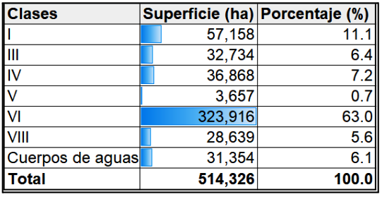

 

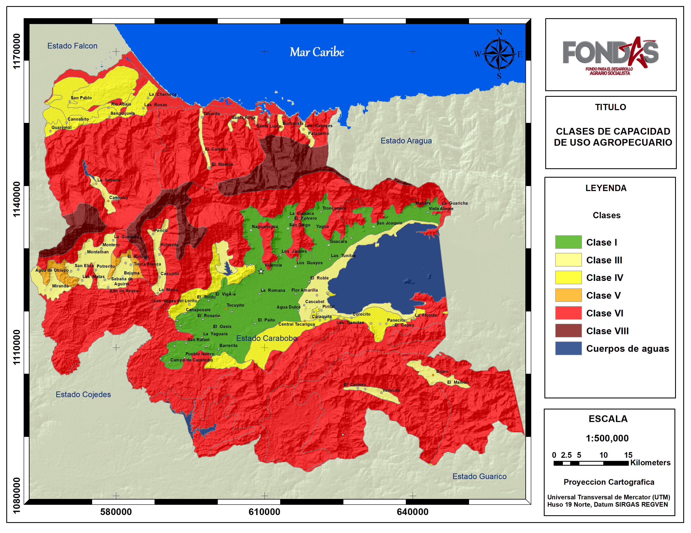
**Figura 29.** Mapa de Clases de Capacidad de Uso Agropecuario de las tierras en el estado Carabobo. <a href="Pdfs/Carabobo_CUSO1.pdf" target="_blank" title="descargas">*Descargar*</a>

 

### Clase de Aptitud para el cultivo de Cereales y Leguminosas {-}

En el estado Carabobo 11.1 % de sus tierras se consideran aptas para el cultivos de Cereales y Leguminosas debido a su mayor potencial y pocas limitaciones físico naturales para el desarrollo de estos rubros. Principalmente se ubican en la cuenca plana del lago de Valencia donde destacan áreas no urbanizadas próximas al lago de Valencia, también los valles intramontanos de los ríos quebradas como Río Cura, Quebrada El ereigue, Quebrada Jabonera (noroeste de Yagua), y áreas no urbanas de San Diego y zona sur de Tocuyito (Caño Las Manzanas, El País, Río El Paito. 

Las tierras con una actitud moderadamente representan unos 6.4%, localizadas en las márgenes del lago de Valencia no inundadas, ni pobladas, Valles en las cuencas de los ríos Guataparo, Canaobo, Chirgua; Sectores de los Valles altos de Carabobo como Aguirre, Bejuma, Montaban, Sabaneta, las Matas y Miranda (rio tigres). Por el lado Sur del estado se encuentran ciertos sectores aislados en las poblaciones de Belén y Manaure.

Marginalmente aptas, es decir potencialmente útiles pero con fuertes limitaciones se encontraron 7.2 % del estado, ubicadas en el piedemonte y faldas de laderas al oeste de la ciudad de Valencia cerca de las poblaciones de Canaposare y el Torito, así como al sur del lago de Valencia en tierras próximas a las poblaciones de Guigue y Los Aguacates. También se encuentra una compacta zona al Noroeste del estado cerca de las poblaciones de San Pablo, Canoabito, Río Abajo y al norte de Urama

Las zonas no aptas alcanzan el 69.3% del estado y son áreas de montañas con altas pendientes, micro relieve irregular, drenaje externos muy rápidos, suelos poco profundos y de baja fertilidad; como también suelos de la planicie costeras próximos a las costas con drenaje internos muy altos

Las figuras 30, 31 y el Cuadro 7 muestran gráficamente la proporcionalidad de las clases y  las localidades con su categorización de aptitud para el cultivo de Cereales y Leguminosas.

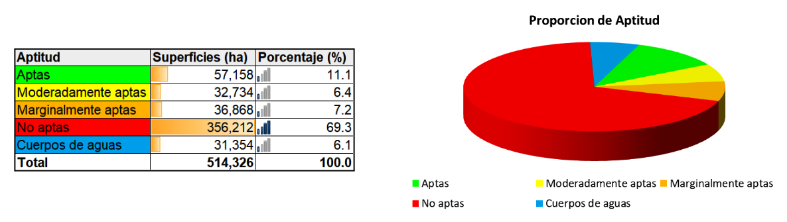**Figura 30.** Proporción de clases de aptitud para el estado Aragua.

 

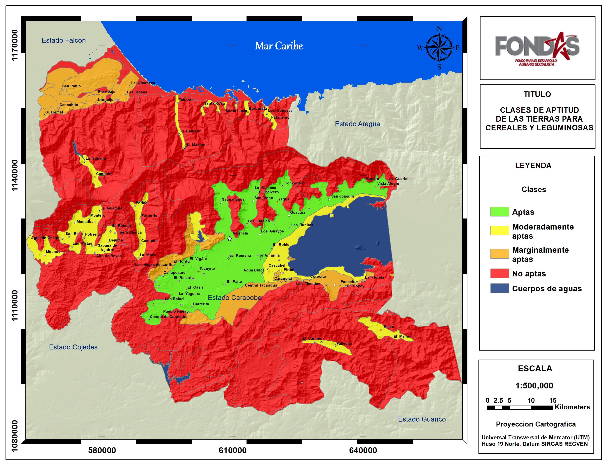
**Figura 31.** Mapa de Clases de Aptitud de las tierras para el cultivo de Cereales y Leguminosas en el estado Carabobo. <a href="Pdfs/Carabobo_Aptitud.pdf" target="_blank" title="descargas">*Descargar*</a>

 
