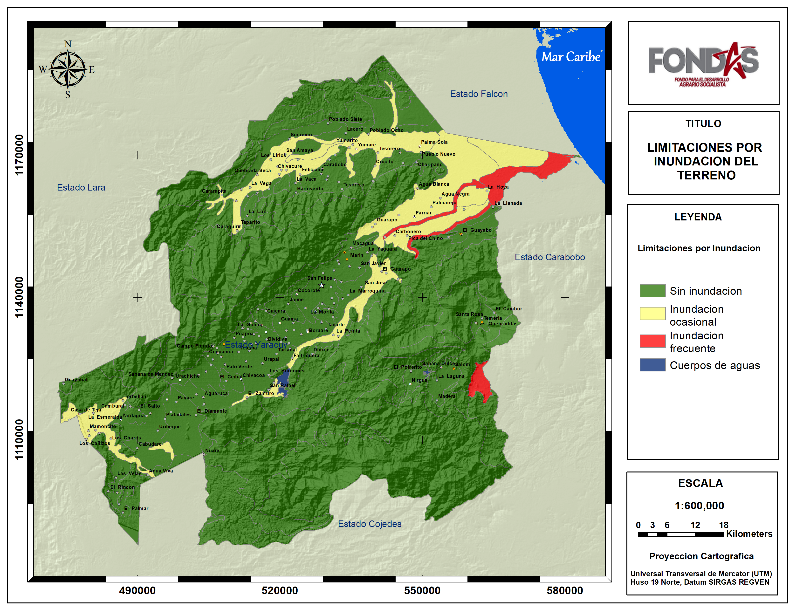

# Yaracuy {-}

### Factores específicos {-}

De la calificación de cada uno de los factores específicos del Sistema de Clasificación por Capacidad de Uso agropecuario aplicado al estado Yaracuy (Figuras 26 a 37), se desprende que las mayores limitaciones del medio físico natural encontradas en el estado para el cultivo de Cereales y leguminosas, son las altas pendientes y el microrelieve del terreno especialmente en las laderas y piedemonte de las montañas de Sierra de Aroa y la montaña de Maria Lionza. Las cuales en algunos casos pueden presentar también limitaciones por profundidad de los suelos específicamente en los piedemontes y estribaciones de la Cordillera y erosión actual en el piedemonte altamente intervenidos por estar cerca de poblaciones importantes como San Felipe, Urachiche y Yaritagua. Otras limitaciones  encontradas son los suelos con cierto nivel de salinidad en la cuenca baja del río Yaracuy. Además existen zonas de baja fertilidad natural, con pH ácidos y baja saturación de bases en las montañas. Finalmente las limitaciones relacionadas con el drenaje interno (niveles freáticos medios a altos) se presentan en la parte media y baja del valle del río Yaracuy (Municipios Veroes) en aquellas terrenos planos y/o depresiones relacionadas con cursos de aguas. Por su parte el drenaje externo en su mayoría es rápido por las grandes pendientes de la zona montañosa, sin embargo se consiguen drenajes lentos en áreas planas y depresionales en la zona noreste del estado. Finalmente las limitaciones por inundación son ocasionales en la planicie aluvial de la cuenca baja del río Yaracuy en el municipio Veroes.

---

**Figura 17.** Calificación de las limitaciones por pendientes del terreno en el estado Yaracuy.  <a href="Pdfs/Yaracuy_Pendiente.pdf" target="_blank" title="descargar">*Descargar*</a>

 

**Figura 18.** Calificación de las limitaciones por microrelieve del terreno en el estado Yaracuy. <a href="Pdfs/Yaracuy_Microrelieve1.pdf" target="_blank" title="descargar">*Descargar*</a>

 

**Figura 19.** Calificación de las limitaciones por erosion del terreno en el estado Yaracuy. <a href="Pdfs/Yaracuy_Erosion1.pdf" target="_blank" title="descargar">*Descargar*</a>

 

**Figura 20.** Calificación de las limitaciones por texturas de los suelos en el estado Yaracuy. <a href="Pdfs/Yaracuy_Texturas.pdf" target="_blank" title="descargas">*Descargar*</a>

 

**Figura 21.** Calificación de las limitaciones por pedregosidad de los suelos en el estado Yaracuy. <a href="Pdfs/Yaracuy_Pedregosidad.pdf" target="_blank" title="descargas">*Descargar*</a>

 

**Figura 22.** Calificación de las limitaciones por profundidad de los suelos en el estado Yaracuy. <a href="Pdfs/Yaracuy_Profundidad1.pdf" target="_blank" title="descargas">*Descargar*</a>

 

**Figura 23.** Calificación de las limitaciones por salinidad de los suelos en el estado Yaracuy. <a href="Pdfs/Yaracuy_Salinidad1.pdf" target="_blank" title="descargas">*Descargar*</a>

 

**Figura 24.** Calificación de las limitaciones por fertilidad de los suelos en el estado Yaracuy. <a href="Pdfs/Yaracuy_Fertilidad1.pdf" target="_blank" title="descargas">*Descargar*</a>

 

**Figura 25.** Calificación de las limitaciones por permeabilidad de los suelos en el estado Yaracuy. <a href="Pdfs/Yaracuy_Permeabilidad1.pdf" target="_blank" title="descargas">*Descargar*</a>

 

**Figura 26.** Calificación de las limitaciones por drenaje interno de los suelos en el estado Yaracuy. <a href="Pdfs/Yaracuy_Dre_interno1.pdf" target="_blank" title="descargas">*Descargar*</a>

 

**Figura 27.** Calificación de las limitaciones por drenaje externo de los suelos en el estado Yaracuy. <a href="Pdfs/Yaracuy_Dre_externo1.pdf" target="_blank" title="descargas">*Descargar*</a>

 

**Figura 28.** Calificación de las limitaciones por inundacion del terreno en el estado Yaracuy. <a href="Pdfs/Yaracuy_Inundacion1.pdf" target="_blank" title="descargas">*Descargar*</a>

 

### Clase de Capacidad de Uso Agropecuario {-}

El estado Yaracuy posee una superficie de 642.228 ha (6422 km2) aproximadamente y de ellas 7.6 % resultaron categorizadas por su capacidad de uso agropecuario como clase I, localizadas en la cuenca media y alta del río Yaracuy en un eje que transcurre de suroeste a noreste en el estado. Por otra parte 13.4 % se categorizó como clase III, ubicadas muy distribuidas en todo el estado destacando las zonas al norte de Yumare, norte del Chino, valle central medio y alto del río Yaracuy y los valles altos de Nirgua y Temerla. Otro 11.4 % resultó clase IV y se localizan mayoritariamente en la cuenca del río Aroa y sus afluentes como el río Yumare, y la cuenca baja del río Yaracuy en el municipio Veroes. El resto de la superficie del estado (67.4%) resultaron de clases iguales o mayores a la clase VI con poco potencial para el cultivo de cereales y leguminosas debido a limitaciones moderadas a fuertes principalmente relacionadas a la pendiente, profundidad, fertilidad y drenaje. (Ver Cuadro 5 y Figura 40).

### Clase de Aptitud para el cultivo de Cereales y Leguminosas {-}

En el estado Yaracuy 7.6 % de sus tierras se consideran aptas para el cultivos de cereales y leguminosas debido a su mayor potencial y pocas limitaciones físico naturales para el desarrollo de estos rubros. Principalmente se ubican en el valle medio y alto del río Yaracuy donde destacan áreas no urbanizadas próximas a las poblaciones de  Marin, La Trilla, El Corozo, Cocorote, Chivacoa, y Aguaruca. 

Las tierras con una actitud moderadamente representan unos 13.4%, localizadas dispersas en el estado, destacan las del bajo Yaracuy cerca de la población La Llanada entre los ríos Yaracuy y Taria; Medio Yaracuy  al sur de San Felipe próximas a La Marroquina, Boraures y El Ceibal; también al noroeste del estado se encuentra una zona  al norte de Yumara, El Kilómetro 63 y al rio Aro; Al sureste del estado se tienen las áreas cercanas a Nirgua (Río Cabuy)  y Temerla (río Temerlita).

Áreas marginalmente aptas, es decir potencialmente útiles pero con fuertes limitaciones se encontraron 11.4 % del estado, ubicadas en su mayoría en los bajos del río Yaracuy y Aroa en los municipios Veroes, San Felipe y Manuel Monge, allí destacan las tierras próximas a los ríos Mayorica, Salado y Quebrada Charipano afluentes del río Yaracuy, y las poblaciones de la Raya y La Hoya; por otro lado se tienen los valles del río Aroa  cerca de los poblados Palma Sola, Tesorero, Yumare, Cruzito, Carabobo, Quebrada seca y el Hacha.

Las zonas no aptas alcanzan el 67.4 % del estado y son áreas de montañas (Sierra de Aroa, Montaña de Maria Lionza, Monte Oscuro, Montaña el Zapatero, La Palma y Nirgua, con altas pendientes, micro relieve irregular, drenaje externos muy rápidos, suelos poco profundos y de baja fertilidad.

Las figuras 45, 46 y el Cuadro 8 muestran gráficamente la proporcionalidad de las clases y  las localidades con su categorización de aptitud para el cultivo de Cereales y Leguminosas.

